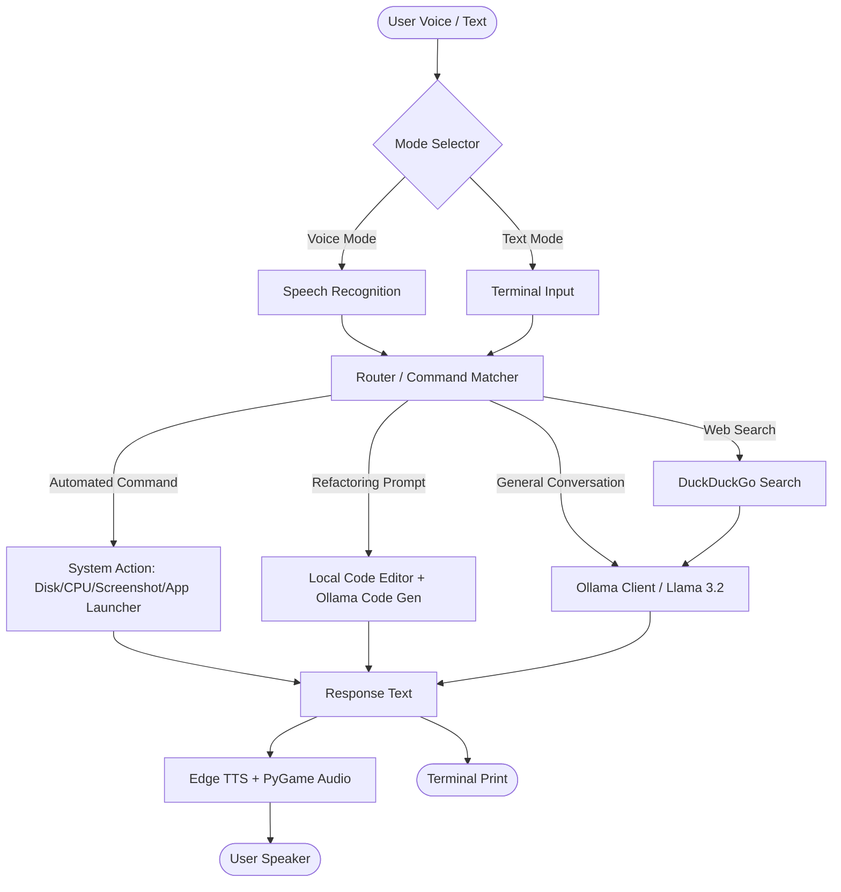

# Zqyrix (pronounced *Zy-rix*) 🚀

Zqyrix is a highly responsive personal AI assistant and desktop automation companion built in Python. Running fully locally, it integrates **Ollama** (defaulting to the `llama3.2` model) as its cognitive brain, and combines offline speech recognition with high-quality cloud-based text-to-speech synthesis to act as a close companion and helper.

---

## Key Features

- 🎙️ **Dual-Mode Interface:** Select between **Voice Mode** (using Speech Recognition and Edge TTS) and **Text Mode** (via terminal inputs).
- 🧠 **Local LLM Integration:** Powered by Ollama (`llama3.2` by default) with conversational session persistence, history trimming, and clean-slate resets.
- 💻 **Desktop Automation & Control:**
  - **Self-Modifying & Code Editing:** Can edit its own codebase or other Python files in the workspace based on natural language prompts (e.g., *"edit chat.py to say hello"*). Auto-generates timestamped backups before editing.
  - **App & Website Launcher:** Open common tools (VS Code, Chrome, Spotify, Task Manager) or websites (GitHub, YouTube, ChatGPT).
  - **Custom Shortcuts Memory:** Dynamically remember new shortcuts on the fly (e.g., *"remember MyFolder is at C:\path\to\folder"*).
- 📊 **System Diagnostics:** Query real-time statistics like CPU usage, RAM utilization, current battery percentage/charging status, and drive space.
- 📸 **Utility Tools:** Take and save desktop screenshots instantly, create/read quick local persistent notes (`notes.txt`), and perform searches on DuckDuckGo/YouTube.

---

## Architecture Diagram



---

## Setup & Installation

### 1. Prerequisites
- **Python 3.10+** installed on your system.
- **Ollama** installed. Download from [ollama.com](https://ollama.com).

### 2. Set Up the Local LLM
Ensure Ollama is running, then pull the default model used by Zqyrix:
```bash
ollama pull llama3.2
```
*(Note: You can configure Zqyrix to use a different model in [brain.py](file:///d:/Zqyrix/brain.py)).*

### 3. Install Dependencies
Clone/download this repository, open your terminal in the project directory, and install the required Python packages:
```bash
pip install -r requirements.txt
```

---

## How to Run

Run the main application script:
```bash
python zqyrix.py
```

Upon launching, choose your desired interaction mode:
- **`1`**: Voice Mode (will listen through your microphone and speak back to you).
- **`2`**: Text Mode (terminal-based interactive chat).

To exit, simply say or type `bye`, `exit`, `quit`, or press `Ctrl + C`.

---

## Configuration & Customization

- **Microphone Index:** If Voice Mode doesn't detect your speech, check [test_mic.py](file:///d:/Zqyrix/test_mic.py) to list and diagnose audio devices on your machine.
- **Default Apps and Websites:** Expand the `APPS` and `WEBSITES` dictionaries in [zqyrix.py](file:///d:/Zqyrix/zqyrix.py) to pre-program your favorite launchers.
- **AI Persona:** Modify the `SYSTEM_PROMPT` in [brain.py](file:///d:/Zqyrix/brain.py) to change Zqyrix's personality, vocabulary, and greeting phrases.
